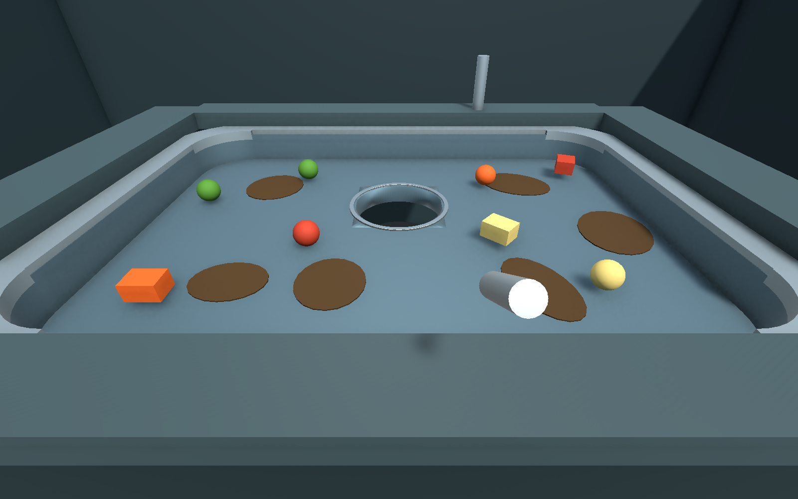
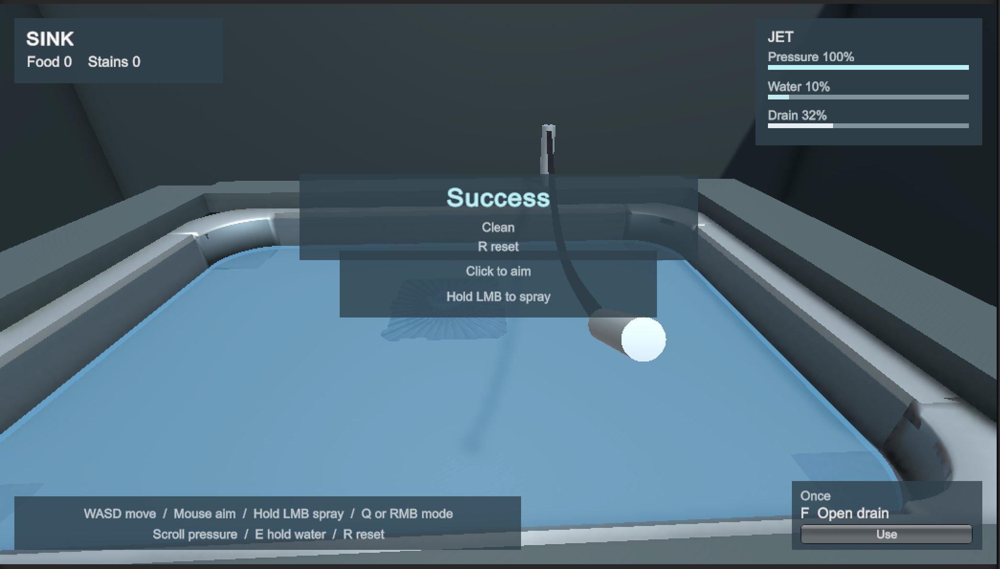
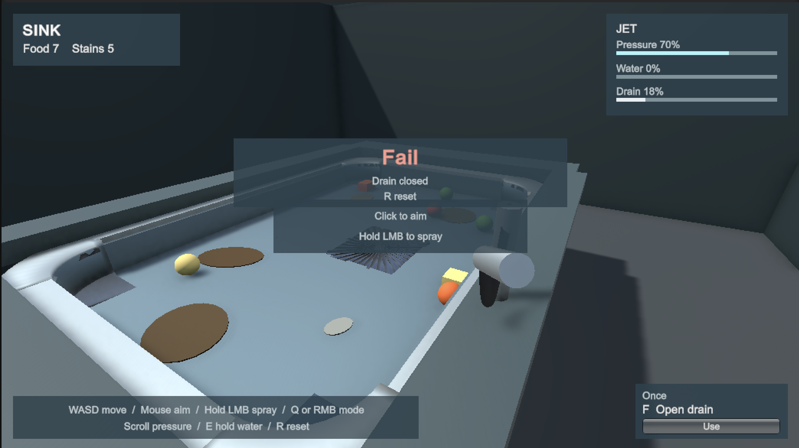
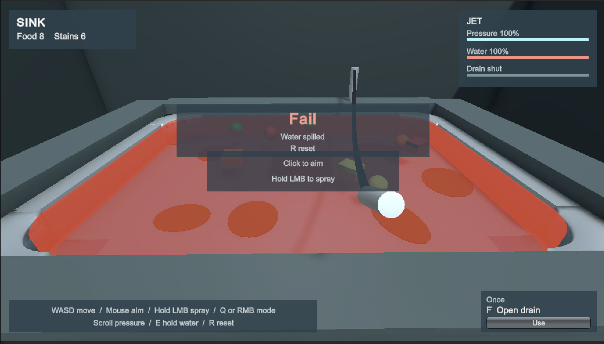
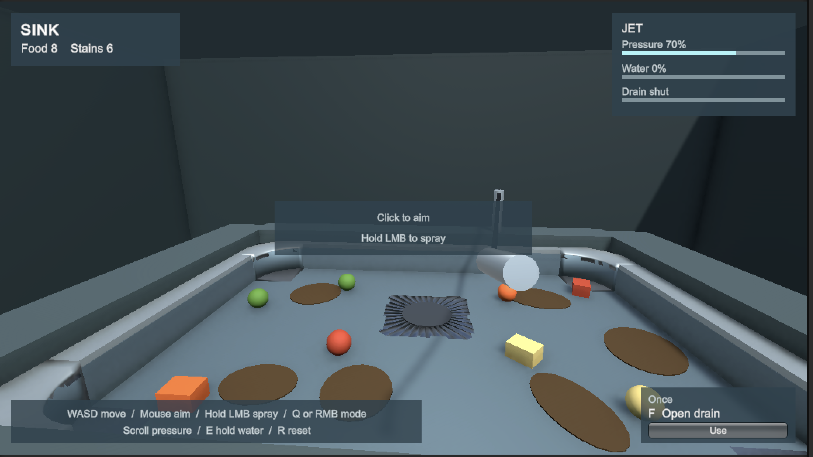

# Clean It Up!

A small first-person Unity prototype about getting stubborn food down a kitchen sink using only water.



The opening image shows the integrated prefabs. The gameplay screenshots below show the earlier v2 prototype.

## Getting started

1. Install Unity Hub and **Unity 6000.3.22f1**, the version recorded in `ProjectSettings/ProjectVersion.txt`.
2. Clone this repository using its **Code** button, or choose **Code > Download ZIP** and extract it.
3. In Unity Hub, add the project folder containing `Assets`, `Packages`, and `ProjectSettings`, then open it with Unity 6000.3.22f1.
4. Allow Unity to download packages and finish importing. Internet access is needed for the Unity package registry on the first open.
5. Open `Assets/SinkLab/Scenes/SinkLab.unity` and press **Play**. Click the Game view if the mouse is released.

This repository contains the editable Unity project. A standalone executable is not included. All gameplay, materials, simple geometry and the water shader are in `Assets/SinkLab`.

## Working with teammates

Commit changes to `Assets` together with their `.meta` files, plus any changed files in `Packages` and `ProjectSettings`. Unity's `Library`, `Temp`, `Logs`, and `UserSettings` folders are ignored because each machine regenerates them. Keep `.meta` files when moving or renaming assets; use the Unity Editor for those operations.

Use separate branches for changes and pull requests to review them. Coordinate edits to the same scene to reduce merge conflicts.

## How to play

Clear every scrap of food and every stain. **Success** appears when both are gone. This prototype focuses on one sink, with no grabbing, countdown display, score, or progression.



**Fail** appears while either of these conditions holds and the sink is still dirty:

- The drain closes completely on its own, with food or stains still left.
- Water crosses the rim and spills.

The indicator follows the current state. It can clear when the water drains below the rim, and an unused F charge can reopen a sealed drain. Press R for a full reset.





Press E to plug the drain and raise the water. While the water rises, floating scraps drift into a new layout. The shallow basin fills quickly, so reopen the drain before it spills. Standing water over an open hole can pull nearby food toward the drain. The hole also creeps smaller on its own, and each swallowed scrap makes it a little smaller. Walk around the counter and aim the spray. Water pushes food downstream. A dry drain does not pull.



| Input | Action |
| --- | --- |
| Mouse | Look and aim. Click the Game view first if the cursor is free |
| WASD | Walk |
| Hold left mouse | Spray |
| Q, right mouse, 1, 2 | Switch focused jet and wide shower |
| Mouse wheel | Pressure. Higher pressure pushes harder and fills the basin faster |
| E | Plug or unplug the drain. Plugged, food floats and drifts; open it again before the water spills |
| F, or Use | Once per sink. The drain snaps fully open, then shrinks back to the size it had before that press at 40 times the normal speed. R restores the charge |
| R | Reset the sink, water, drain, and the one-shot charge |
| Escape | Release the mouse and stop spraying |

The bottom bar lists these controls. The lower-right card is the one-shot drain tool and is marked **Once**. The rounded basin and circular drain opening are visible in both the Scene and Game views.

## How it works

- A CharacterController provides FPS movement and prevents walking through the sink.
- The Input System handles mouse and keyboard. Releasing focus or pressing Escape stops the water; the click used to recapture the cursor does not spray.
- Water raycasts from the view to select the aim point, then from the nozzle to check obstruction. The surface footprint transfers impulses to rigidbodies. Particles and lines show the stream and splashes; these visuals do not secretly collect food.
- Stains shrink progressively under exposed water. Food has mass, friction, gravity, collisions and momentum. A scrap is collected only after its center passes below the circular drain opening.
- Walls rebound food through physical contact. Their native physics material uses bounciness `0.4` and `Maximum` bounce combination; the global bounce threshold remains `2 m/s`. Hard contacts can rebound while gentle contact and the basin floor stay calm. Spraying near a corner has no extra range or invisible escape force. The separate shuffle while standing water rises is retained.
- Water height follows the sink's position and yaw at unit scale. Buoyancy, wet friction, drain pull and vortex height use the world surface; water depth and volume geometry stay local to the sink.
- The water shader and all shapes are simple procedural/default assets. Audio is disabled for the class prototype; the procedural running-water sound is preserved behind the default-off `WaterVisuals.enableWaterAudio` option. Leave it off for the submission. It can be restored before entering Play mode when audio is allowed again.

## Prefab authoring

The level is composed from connected, nested prefab instances. `SinkWorld` coordinates references, progress, reset and standing water. Basin walls, corners, rim and floor are saved assets; Play mode does not rebuild them. Water visuals and the shrinking drain opening still respond at runtime.

```text
Sink Level                         [Levels/SinkLevel.prefab]
├── Player                         [Player/Player.prefab]
├── Sink                           [Sink/Sink.prefab]
│   ├── Floor                      [4 SinkFloor instances]
│   ├── Walls                      [4 SinkWall instances]
│   ├── Rim                        [4 SinkRim instances]
│   ├── Counter                    [4 CounterPanel instances]
│   ├── Cabinet                    [4 CabinetPanel instances]
│   ├── Rounded corners            [Parts/RoundedBasinCorners.prefab]
│   ├── Drain                      [Parts/Drain.prefab]
│   │   ├── Rim                    [Parts/DrainRim.prefab; one continuous hollow mesh]
│   │   ├── Drain opening          [one mesh shared by renderer and MeshCollider]
│   │   └── Drain plug             [saved stopper]
│   └── Faucet                     [Parts/Faucet.prefab]
├── Mess
│   ├── Food                       [FoodCube / FoodSphere instances]
│   └── Stains                     [Stain instances]
└── Environment
    ├── Room                       [Room.prefab; floor and grouped wall instances]
    └── Lighting                   [Lighting.prefab]
```

Reusable prefabs are under `Assets/SinkLab/Prefabs`. The fixed drain rim is a single hollow annular mesh in `Meshes/DrainRim.asset`, nested through `Sink/Parts/DrainRim.prefab`; it has no individual lip objects. The separate `Meshes/DrainOpening.asset` defines the circular hole in the basin floor. Its renderer and one non-convex MeshCollider share the same mesh, including when the radius changes during play. The collider remains on the static sink and the center stays open.

Open a part prefab to edit shared behavior or appearance; its connected instances inherit the change. Open `Sink.prefab` to arrange its pieces together, including the nested `RoundedBasinCorners.prefab`. Select its parent to move the entire sink, or a subgroup such as `Walls` to manipulate those pieces together. Keep assembly/group scales at one; size the individual panels. Food spheres use uniform scale to match their colliders.

Food placements vary color and mass using deliberate instance overrides; stain placements vary size and rotation. Other common behavior stays inherited. Use a prefab variant for a reusable alternative instead of unpacking it. Instance overrides take precedence over future changes to those specific properties on the source prefab.

To author another level, duplicate the scene or drag `SinkLevel.prefab` into a scene. Arrange the `Player`, `Sink`, and `Mess` groups, and add food/stain prefab instances beneath the level's `Mess` group. The level gathers its own pieces and binds player, sink, HUD, and hose references when Play starts. The `SinkWorld` component's **Refresh Level References** context menu also refreshes them while editing. A player prefab contains its camera, nozzle, water, visuals and HUD; its references to a particular level and faucet anchor are assigned by the level. Use one active player for ordinary play.

`Sink Lab > Create level from prefabs` restores the example scene from the current `SinkLevel.prefab`. Save existing scene changes first, and use a scene copy to retain manual variations. This command instantiates the prefab and never regenerates its parts or overwrites prefab edits.

The original scene, including its unsaved state at conversion time, is preserved at `Assets/SinkLab/Scenes/Backups/BeforePrefabRefactor.unity`. `SinkPrefabMigration` is a guarded one-time conversion tool; it refuses to overwrite the completed prefab library. `SinkGeometryAuthoring` saves rounded basin geometry and the initial drain opening for the integrated prototype; it is an Editor authoring tool, not a Play mode builder.

## Verification

Unity Test Runner assemblies:

- `SinkLab.EditModeTests`: adversarial contracts against the populated world plus the actual saved scene, including occlusion positive controls, water-off behavior, completion, local drain geometry, reset, persistent wet friction, matching food colliders, grounded movement, prefab nesting/inheritance, and isolation between levels.
- `SinkLab.PlayModeTests`: synthetic mouse and keyboard events exercise production controls; water tests compare translated and yaw-rotated sinks, buoyancy, drain tools and reset.

`Assets/SinkLab/Runtime/SinkGameplayAudit.cs` is an editor-only complete-playthrough driver. It walks the same controller, aims the same camera, and switches the same faucet. It never applies forces to food or directly cleans/collects anything. Use `Sink Lab > Run complete gameplay audit` to start it. It writes its observations and scene captures under `Verification`.

Executed results and captures live in `Verification`. Check each report's date and scope; historical passes and screenshots do not verify later changes.
