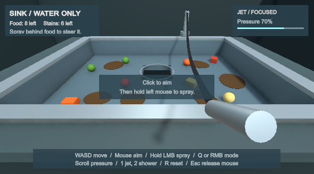

# Clean the Sink

A small first-person Unity prototype about getting stubborn food down a kitchen sink using only water.



## Getting started

1. Install Unity Hub and **Unity 6000.3.22f1**, the version recorded in `ProjectSettings/ProjectVersion.txt`.
2. Clone this repository using its **Code** button, or choose **Code > Download ZIP** and extract it.
3. In Unity Hub, add the project folder containing `Assets`, `Packages`, and `ProjectSettings`, then open it with Unity 6000.3.22f1.
4. Allow Unity to download packages and finish importing. Internet access is needed for the Unity package registry on the first open.
5. Open `Assets/SinkLab/Scenes/SinkLab.unity` and press **Play**. Click the Game view if the mouse is released.

This repository contains the editable Unity project. A standalone executable is not included. All gameplay, materials, simple geometry and the water shader are in `Assets/SinkLab`.

## Working with teammates

Commit changes to `Assets` together with their `.meta` files, plus any changed files in `Packages` and `ProjectSettings`. Unity's `Library`, `Temp`, `Logs`, and `UserSettings` folders are ignored because each machine regenerates them. Keep `.meta` files when moving or renaming assets; use the Unity Editor for those operations.

Use separate branches for changes and pull requests to review them. Coordinate edits to the same scene to reduce merge conflicts.

## Controls

| Input | Action |
| --- | --- |
| Mouse | Look and aim |
| WASD | Walk around the sink |
| Hold left mouse | Spray water |
| Q or right mouse | Switch focused jet / wide shower |
| 1 / 2 | Select jet / shower |
| Mouse wheel | Adjust pressure |
| R | Restore the dirty sink and starting position |
| Escape | Release the mouse and stop spraying |

Aim just behind a scrap to guide it with the spreading water. Direct hits push in the stream's direction. Walk around the island to approach stubborn food from another angle. The focused jet is stronger; the wide shower covers more of a stain. Lower pressure helps near the drain.

The sink is finished only when all eight physical scraps enter the actual drain opening and all six stains wash away. There is no grabbing, timer, scoring or progression system.

## How it works

- A CharacterController provides FPS movement and prevents walking through the sink.
- The Input System handles mouse and keyboard. Releasing focus or pressing Escape stops the water; the click used to recapture the cursor does not spray.
- Water raycasts from the view to select the aim point, then from the nozzle to check obstruction. The surface footprint transfers impulses to rigidbodies. Particles and lines show the stream and splashes; these visuals do not secretly collect food.
- Stains shrink progressively under exposed water. Food has mass, friction, gravity, collisions and momentum. A square drain check matches the actual square floor opening and only collects scraps below the floor.
- The water shader and all shapes are simple procedural/default assets. Running-water audio is generated in memory.

## Prefab authoring

The level is composed from connected, nested prefab instances. `SinkWorld` coordinates references, progress and reset; it no longer creates meshes, materials or scene objects.

```text
Sink Level                         [Levels/SinkLevel.prefab]
├── Player                         [Player/Player.prefab]
├── Sink                           [Sink/Sink.prefab]
│   ├── Floor                      [4 SinkFloor instances]
│   ├── Walls                      [4 SinkWall instances]
│   ├── Rim                        [4 SinkRim instances]
│   ├── Counter                    [4 CounterPanel instances]
│   ├── Cabinet                    [4 CabinetPanel instances]
│   ├── Drain                      [Parts/Drain.prefab; one nested DrainRim mesh]
│   └── Faucet                     [Parts/Faucet.prefab]
├── Mess
│   ├── Food                       [FoodCube / FoodSphere instances]
│   └── Stains                     [Stain instances]
└── Environment
    ├── Room                       [Room.prefab; floor and grouped wall instances]
    └── Lighting                   [Lighting.prefab]
```

All 18 reusable prefabs are under `Assets/SinkLab/Prefabs`. The drain rim is a single hollow annular mesh in `Meshes/DrainRim.asset`, nested through `Sink/Parts/DrainRim.prefab`; it has no individual lip objects. Open a part prefab to edit shared behavior or appearance; its connected instances inherit the change. Open `Sink.prefab` to arrange its pieces together. Select its parent to move the entire sink, or a subgroup such as `Walls` to manipulate those pieces together. Keep assembly/group scales at one; size the individual panels. Food spheres use uniform scale to match their colliders.

Food placements vary color and mass using deliberate instance overrides; stain placements vary size and rotation. Other common behavior stays inherited. Use a prefab variant for a reusable alternative instead of unpacking it. Instance overrides take precedence over future changes to those specific properties on the source prefab.

To author another level, duplicate the scene or drag `SinkLevel.prefab` into a scene. Arrange the `Player`, `Sink`, and `Mess` groups, and add food/stain prefab instances beneath the level's `Mess` group. The level gathers its own pieces and binds player, sink, HUD, and hose references when Play starts. The `SinkWorld` component's **Refresh Level References** context menu also refreshes them while editing. A player prefab contains its camera, nozzle, water, visuals and HUD; its references to a particular level and faucet anchor are assigned by the level. Use one active player for ordinary play.

`Sink Lab > Create level from prefabs` restores the example scene from the current `SinkLevel.prefab`. Save existing scene changes first, and use a scene copy to retain manual variations. This command instantiates the prefab and never regenerates its parts or overwrites prefab edits.

The original scene, including its unsaved state at conversion time, is preserved at `Assets/SinkLab/Scenes/Backups/BeforePrefabRefactor.unity`. `SinkPrefabMigration` is a guarded one-time conversion tool; it refuses to overwrite the completed prefab library.

## Verification

Unity Test Runner assemblies:

- `SinkLab.EditModeTests`: adversarial contracts against the populated world plus the actual saved scene, including occlusion positive controls, water-off behavior, completion, local drain geometry, reset, persistent wet friction, matching food colliders, grounded movement, prefab nesting/inheritance, and isolation between levels.
- `SinkLab.PlayModeTests`: actual synthetic mouse and keyboard events exercise the production input and movement code.

`Assets/SinkLab/Runtime/SinkGameplayAudit.cs` is an editor-only complete-playthrough driver. It walks the same controller, aims the same camera, and switches the same faucet. It never applies forces to food or directly cleans/collects anything. Use `Sink Lab > Run complete gameplay audit` to start it. It writes its observations and scene captures under `Verification`.

The latest executed results and captures live in `Verification`.

## Unity CLI

Install the [official Unity CLI](https://docs.unity.com/en-us/unity-cli/use-unity-cli) once per computer; the same installation works across projects and Editor versions. Controlling a running Editor requires Unity 6.0 LTS or later and the Unity Pipeline package (`com.unity.pipeline`) in each project. This project's `Packages/manifest.json` already includes Pipeline.

With this project open in Unity, use `./Tools/unity status --format json` from the project directory to check its connection, or `./Tools/unity command --format json` to list available Editor commands. This checked launcher requires Python 3 and forwards arguments to the installed Unity CLI. In Codex, run it with `sandbox_permissions: "require_escalated"` so the CLI can inspect host processes and reach the local Editor.

The installed CLI can mistake a sandbox-denied process check for a dead Editor and delete its discovery file. The launcher refuses to start the CLI when process inspection is blocked, preserving the connection. Do not bypass it with a raw sandboxed `unity` invocation. See [AGENTS.md](AGENTS.md) for the project workflow and [the diagnostic results](Verification/CliReliability/RESULTS.md) for the reproduction and validation.

For another project, add Pipeline with `./Tools/unity pipeline install --project-path "/path/to/project"`, then let Unity finish importing.
